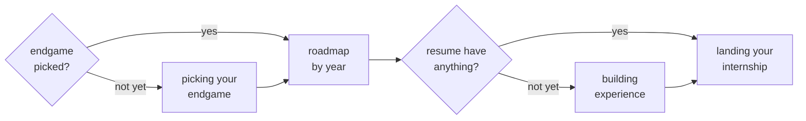

# start here

this is the roadmap for going from "I have no idea what I'm doing" to a real offer in hand. read this one first, then the other guides in this section go deeper on the individual pieces.

## how to use this section

the main pages in zero-to-hero, and the order to read them in. the underlined boxes link straight to that guide, so you can jump in from wherever you actually are.

## reverse engineer your roadmap

where do you actually want to be in five years?

we mean the real answer, so the one you'd give a friend and not the polished one you'd give a recruiter at a career fair. a $250k+ offer at a company like Google or Meta? a solid mid-tier SWE role with real work-life balance? a research track into AI/ML or a PhD? your own startup? an amazing security analyst working for cyber threat intelligence firms? every one of those is a legitimate end goal, and every one needs a different path to get there.

that's the step most people skip. they start grinding LeetCode or blasting out applications without ever asking what all those reps are pointed at. work backward instead:

- **FAANG or FAANG-adjacent comp** reverse engineers into a target-company return offer junior year. that needs a mid-tier internship sophomore year for real interview reps, which needs LeetCode fundamentals + a shipped project by the end of freshman year.
- **AI/ML, quant, or research** reverse engineers into a technical or research-heavy internship junior year. that needs a serious research project or a specialized internship sophomore year, which sometimes counts for more than a generic internship would.
- **stability over prestige** reverse engineers into consistent, steady reps every year, so you're never optimizing hard for one specific company name.

different destination, different path backward. so nail down your actual endgame first, and [[picking-your-endgame]] goes deep on that part. then use the roadmap below to work out what has to be true at each stage to get you there.

## mindset, get locked in

breaking into tech doesn't require a specific pedigree, and it doesn't require aiming at FAANG. plenty of people build a great career and never touch a top-5 company. it doesn't matter what walk of life you're coming from either, dedication is the thing that actually gets you there:

- **reps.** projects, LeetCode, applications, cold messages. none of them look like much on their own. the compounding shows up after volume, so one good day won't show you much of anything yet.
- **activation energy.** starting is always the hardest part, and continuing is the easy part. the first project, the first cold message, the first application all cost way more than the hundredth one does.
- **initiative.** nobody hands you a roadmap. the programs, the workshops, the people worth reaching out to all exist, but you have to go find them yourself (this is the one we watch people wait on the longest).

getting "locked in" isn't a personality some people have and others don't. it's just choosing, on purpose, to put your reps into the thing you say you want instead of whatever's easiest that day. less experience right now isn't a wall, it's just where your reps haven't landed yet.

reverse engineering gives you the destination and mindset is what actually gets you moving toward it. put the two together and the only thing left is figuring out where you're standing right now, so you know which leg of the path you're on.

## where you are on the roadmap

map yourself onto the closest stage by skill level and time-to-graduation. if you're not on a traditional freshman-to-senior track, go by that instead of your literal year. each page below covers what the stage should look like, coursework included, and how to step it up:

- [[freshman-year]]
- [[sophomore-year]]
- [[junior-year]]
- [[senior-year]]

**the general shape:** first internship (sophomore or junior year) → a bigger, often out-of-state internship (junior or senior year) → FAANG or FAANG-adjacent, if that's actually what you want. it isn't the right goal for everyone though.

## case study, liam ellison

Liam is progsu's CTO, he interned at a quant trading firm, and he did it coming out of a non-target school. he knew early that quant was the endgame, so pretty much every move after that traces back to one question instead of a lucky sequence of good decisions.

first, he sequenced his internships instead of just stacking them. quant firms hire almost entirely on interview strength, so he worked backward from that. mid-tier company first, purely for real interview reps + leverage, then he aimed at the bigger names once he had that experience under him. no swinging for the biggest name available on his first try.

then there's LeetCode, which he treated as pattern recognition rather than volume. quant interviews test whether you can actually reason live, and having a solution memorized doesn't help you there, so he built his prep to match. stop grinding for problem count. solve a problem, then re-solve it later, and keep re-solving until you can walk from brute force to an optimized solution live.

the last one is networking, where he leaned warm instead of cold. quant roles are disproportionately referral- and relationship-driven, and once he knew that, cold applications stopped being where he spent his time. most of his best opportunities came from referrals + in-person contact at recruiting events instead.

none of it was luck. every choice traces back to one question he asked early: what does landing a quant offer actually require, and what has to be true a year before that to make it possible.

## where to go next

- [[picking-your-endgame]], for figuring out what role and company type you're actually chasing
- [[building-experience-early]], if your resume is still empty and you need something real to put on it
- [[landing-your-first-internship]], once you know roughly what you're aiming for and need the actual search playbook

## turn this into action

before you close this tab, open a doc and write down two things. first, where you actually are on the roadmap above, and be honest about it, since the wishful version won't help you plan anything. second, one thing you can do this week that moves you forward, so for example one application, one cold message, one LeetCode session.

if you want a coach for this, take the roadmap on this page and hand it to an AI assistant along with your year, major, and current situation. then ask it to help you scope a realistic quarter-by-quarter plan. after that it's on you to hold yourself to it the same way you'd hold yourself to a workout plan, since the roadmap ONLY works if you actually follow it.
